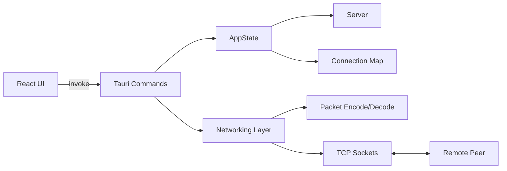
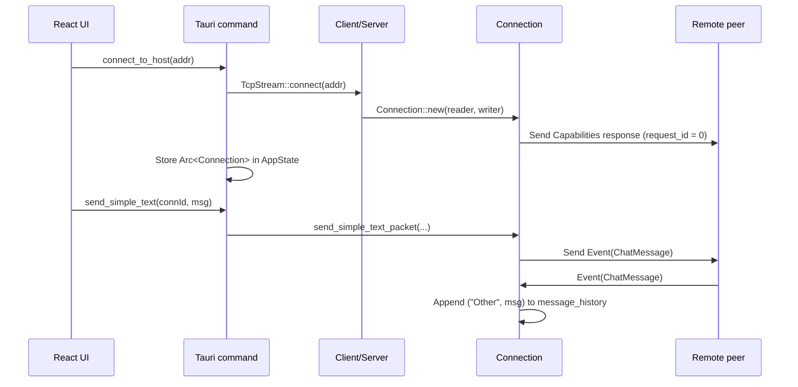
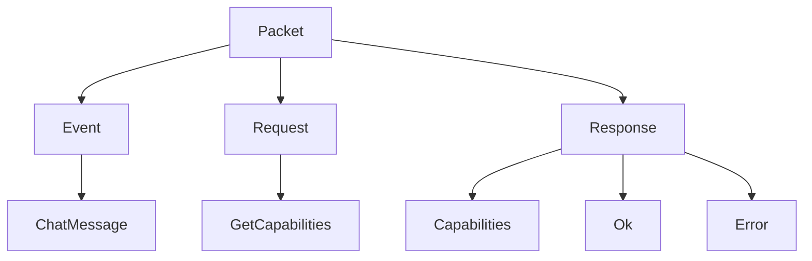
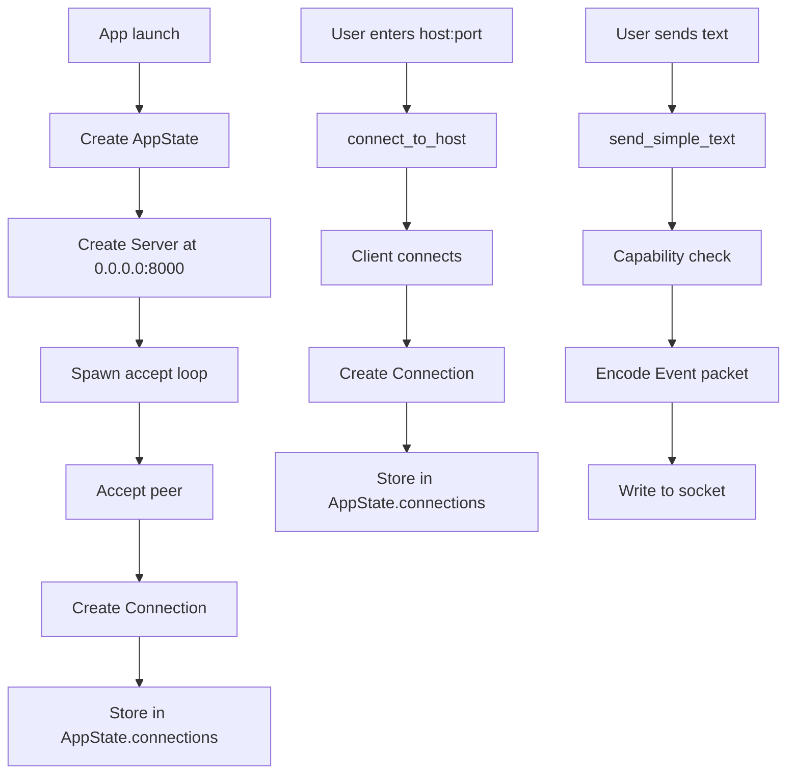

# Ghostline Project Overview

## What this project is

`ghostline` is a desktop application built with:

- `Tauri 2` for the desktop shell and Rust backend
- `React 19` for the frontend UI
- `Vite 7` for frontend bundling and development
- `Tokio` for async TCP networking in Rust

The current product direction is a local-network or direct-peer chat tool built around a custom binary packet protocol. The frontend is a thin control surface. The real core of the project is the Rust networking layer.

## High-level intent

The codebase is moving toward this model:

1. Start a local TCP server when the app launches.
2. Allow the user to connect to another host by address.
3. Exchange capability information between peers.
4. Send and receive simple text chat messages over a custom protocol.
5. Expose all of that to the React UI through Tauri commands.

At the moment, the app is functional in pieces, but still incomplete. The networking core is farther along than the frontend or the request-handling layer.

## Repository structure

```text
ghostline/
├── src/                      # React frontend
│   ├── App.tsx               # Main UI
│   ├── App.css               # Tailwind import + global styles
│   ├── main.tsx              # React entrypoint
│   └── assets/               # Frontend static assets
├── src-tauri/                # Rust + Tauri application
│   ├── src/
│   │   ├── main.rs           # Rust binary entrypoint
│   │   ├── lib.rs            # Tauri setup + commands
│   │   ├── state.rs          # Shared application state
│   │   └── net/              # Networking subsystem
│   │       ├── mod.rs        # Connection abstraction + read loop
│   │       ├── client.rs     # Outbound TCP client
│   │       ├── server.rs     # Inbound TCP server
│   │       ├── packet.rs     # Packet encode/decode
│   │       ├── utils.rs      # Message helpers
│   │       └── pending_requests.rs
│   ├── tauri.conf.json       # Tauri app configuration
│   ├── Cargo.toml            # Rust dependencies
│   ├── capabilities/         # Tauri capability declarations
│   └── packet_structure.md   # Protocol specification
├── package.json              # Frontend dependencies and scripts
├── vite.config.ts            # Vite config
└── README.md                 # Template README, not project-specific yet
```

## Architecture at a glance



## Frontend

### Current role

The frontend is a simple operator console. It currently:

- shows the server address
- connects to a remote host
- lists tracked connections
- selects a connection
- sends a simple text message
- displays locally-added sent messages

### Main files

- [src/App.tsx](/home/immortal/code/ghostline/src/App.tsx)
- [src/main.tsx](/home/immortal/code/ghostline/src/main.tsx)
- [src/App.css](/home/immortal/code/ghostline/src/App.css)

### Frontend behavior

The UI calls these Tauri commands through `invoke(...)`:

- `get_server_address`
- `get_my_connections`
- `connect_to_host`
- `send_simple_text`

The frontend does not yet render actual remote message history from Rust. The current chat pane shows only messages the local UI has appended after a successful send.

## Backend

### Rust entrypoints

- [src-tauri/src/main.rs](/home/immortal/code/ghostline/src-tauri/src/main.rs)
- [src-tauri/src/lib.rs](/home/immortal/code/ghostline/src-tauri/src/lib.rs)

`main.rs` is minimal. It delegates to `ghostline_lib::run().await`.

`lib.rs` is the backend control center. It:

- creates application state
- creates and stores a server bound to `0.0.0.0:8000`
- spawns the TCP server accept loop
- registers Tauri commands
- boots the Tauri app

### Shared application state

File:

- [src-tauri/src/state.rs](/home/immortal/code/ghostline/src-tauri/src/state.rs)

`AppState` stores:

- `server: RwLock<Option<Arc<Server>>>`
- `connections: Arc<Mutex<HashMap<String, Arc<Connection>>>>`

The connection map key is effectively the connection id used by the UI. In practice this is a string address such as `127.0.0.1:8000` or the accepted peer socket address.

## Tauri command surface

Defined in:

- [src-tauri/src/lib.rs](/home/immortal/code/ghostline/src-tauri/src/lib.rs)

### `greet(name: &str) -> String`

Template command from the default Tauri scaffold. Not part of the actual product logic.

### `get_server_address() -> String`

Returns the configured server bind address if the server exists, otherwise `"Server not running"`.

### `connect_to_host(addr: String) -> Result<bool, String>`

Creates an outbound TCP client connection to `addr`, wraps it in a `Connection`, and stores it in `AppState.connections`.

### `get_connection_messages(id: String, limit: u32, skip: u32) -> Result<bool, String>`

Looks up the connection and fetches messages from its history, but currently returns only `bool` instead of returning the messages. This means the data is retrieved but discarded.

### `get_my_connections() -> Result<Vec<String>, String>`

Returns the list of connection ids currently tracked in the app state.

### `send_simple_text(conn_id: String, msg: String) -> Result<(), String>`

Looks up the selected connection and sends a `ChatMessage` event packet through the helper in `net/utils.rs`.

## Networking subsystem

Files:

- [src-tauri/src/net/mod.rs](/home/immortal/code/ghostline/src-tauri/src/net/mod.rs)
- [src-tauri/src/net/client.rs](/home/immortal/code/ghostline/src-tauri/src/net/client.rs)
- [src-tauri/src/net/server.rs](/home/immortal/code/ghostline/src-tauri/src/net/server.rs)
- [src-tauri/src/net/utils.rs](/home/immortal/code/ghostline/src-tauri/src/net/utils.rs)
- [src-tauri/src/net/packet.rs](/home/immortal/code/ghostline/src-tauri/src/net/packet.rs)

### Main types

#### `Server`

`Server` binds a `TcpListener`, accepts sockets forever, wraps each accepted socket as a `Connection`, and hands it back through a callback.

#### `Client`

`Client` opens an outbound `TcpStream`, splits it into read and write halves, and constructs a `Connection`.

#### `Connection`

`Connection` is the central runtime abstraction. It stores:

- a write half for outbound packets
- a pending request map for request/response correlation
- an incrementing request id counter
- connection capabilities received from the peer
- message history captured from received events

### Connection lifecycle



### Important note about capabilities

Each `Connection` immediately sends a `Response::Capabilities` packet with `request_id = 0` when it starts. This is being used as a custom handshake even though it is not a formal response to a request.

Current advertised capabilities:

- `CLEAR_TEXT`
- `NO_AUTH`
- `SIMPLE_TEXT_CHAT`

This means a connection may reject `send_simple_text` until the peer capability packet has been received and stored.

## Packet protocol

Primary sources:

- [src-tauri/src/net/packet.rs](/home/immortal/code/ghostline/src-tauri/src/net/packet.rs)
- [src-tauri/packet_structure.md](/home/immortal/code/ghostline/src-tauri/packet_structure.md)

The protocol is a custom binary format with:

- version byte
- packet type byte
- packet-specific payload
- big-endian integer encoding

### Packet families



### Implemented packet variants

#### Event

- `ChatMessage(String)`

#### Request

- `GetCapabilities`

#### Response

- `Capabilities { caps: Vec<String> }`
- `Ok`
- `Error { message: String }`

### Encode/decode responsibilities

`packet.rs` handles:

- serialization of `Packet` to raw bytes
- deserialization of raw bytes back into `Packet`
- round-trip tests for all currently implemented packet variants

### Message layout example

Chat message `"hello"` becomes:

```text
01 01 01 00 00 00 05 68 65 6c 6c 6f
```

Meaning:

- `01` protocol version
- `01` event packet
- `01` chat message subtype
- `00 00 00 05` payload length
- `68 65 6c 6c 6f` UTF-8 bytes for `hello`

## Read loop behavior

The `Connection::new(...)` constructor spawns a Tokio task that:

1. sends the initial capabilities packet
2. reads bytes from the socket in a loop
3. decodes incoming packets
4. routes packets by type

Routing rules:

- `Packet::Response`
  - if `request_id != 0`, try to fulfill a pending request
  - if it is a capabilities payload, update `connection_capabilities`
- `Packet::Event`
  - if it is `ChatMessage`, append to `message_history` as `("Other", msg)`
- `Packet::Request`
  - currently recognized
  - currently not actually handled correctly
  - reaches a `todo!()` path after constructing an `Ok` response

## Current data flow



## Build and toolchain

### Frontend

Defined in:

- [package.json](/home/immortal/code/ghostline/package.json)
- [vite.config.ts](/home/immortal/code/ghostline/vite.config.ts)

Key points:

- uses `tailwindcss` via `@tailwindcss/vite`
- `bun run build` runs `tsc && vite build`
- `bun run dev` runs the Vite dev server

### Desktop packaging

Defined in:

- [src-tauri/tauri.conf.json](/home/immortal/code/ghostline/src-tauri/tauri.conf.json)

Key points:

- product name: `ghostline`
- identifier: `com.subhranil.ghostline`
- window size: `800 x 600`
- `beforeDevCommand`: `bun run dev`
- `beforeBuildCommand`: `bun run build`

### Rust dependencies

Defined in:

- [src-tauri/Cargo.toml](/home/immortal/code/ghostline/src-tauri/Cargo.toml)

Important crates:

- `tauri`
- `tauri-plugin-opener`
- `serde`
- `serde_json`
- `tokio` with `full` feature set

## What is working now

- app boots as a Tauri desktop app
- frontend builds successfully
- Rust backend builds successfully
- local server is started on app launch
- outbound connection creation exists
- accepted inbound connections are stored
- connection list can be returned to the frontend
- simple text packets can be sent if capability negotiation has completed
- incoming chat events are appended to per-connection message history
- packet encoding and decoding have unit tests

## What is incomplete or incorrect

This is the most important section if someone wants to continue development.

### 1. `get_connection_messages` discards real data

The function fetches message history into `chats` and then returns `Result<bool, String>`. It should return the messages themselves.

### 2. Incoming request handling is unfinished

In `Connection::new(...)`, `Packet::Request` handling constructs a response and then hits `todo!()`. Any incoming request on that path will panic the task.

### 3. The capability handshake is ad hoc

Capabilities are sent as a `Response` with `request_id = 0` rather than through a cleaner handshake model. This works only because the code special-cases it.

### 4. The frontend chat view is not backed by backend history yet

The UI shows locally added sent messages, not the real `message_history` from Rust.

### 5. No event push from backend to frontend

The backend stores messages internally, but there is no Tauri event emission or subscription path to notify the UI when new packets arrive.

### 6. Socket framing is simplistic

The read loop uses a fixed `4096` byte buffer and assumes each `read(...)` yields exactly one full packet. That is unsafe for TCP because packets may be split or coalesced across reads.

### 7. Error handling is still rough

Several places still use `unwrap()` in async networking code. This can crash tasks on normal network failures.

### 8. There is no connection identity model beyond socket address strings

The state map uses raw address strings as ids. This is workable for now, but not robust if the product later adds usernames, reconnection, or multiple logical sessions per host.

### 9. There is no authentication or encryption

The capability list explicitly includes `NO_AUTH` and uses clear text messaging.

### 10. The README is still template content

The root README does not describe the actual project.

## Recommended next steps

### Short-term

1. Change `get_connection_messages` to return `Vec<(String, String)>`.
2. Poll or subscribe to message updates from the frontend.
3. Replace the `todo!()` request path with a real request handler.
4. Remove remaining `unwrap()` calls in network paths.

### Medium-term

1. Add packet framing with explicit buffering for partial TCP reads.
2. Introduce a proper handshake model instead of `request_id = 0`.
3. Add a typed connection identity object instead of raw address keys.
4. Emit Tauri events for inbound messages so the UI updates live.

### Longer-term

1. Add authentication and peer identity.
2. Add encrypted transport or application-layer encryption.
3. Support richer message types beyond plain text.
4. Replace the current template README with project-specific docs and usage instructions.

## Practical mental model

If you need one sentence to remember the project:

`ghostline` is a Tauri desktop shell around a Rust TCP chat engine that uses a custom binary protocol and currently exposes a basic React control panel for manual connection and message sending.
