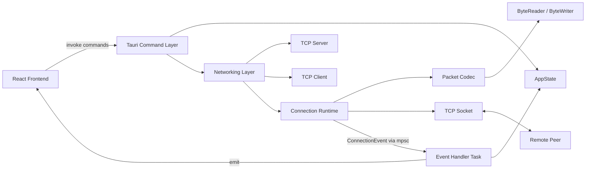
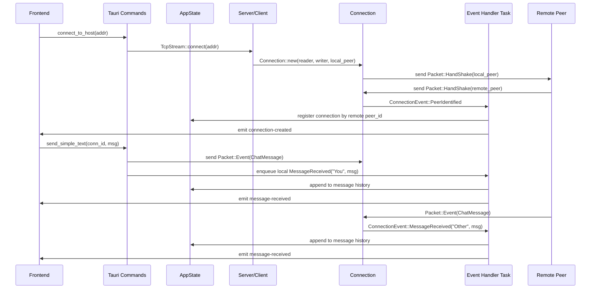
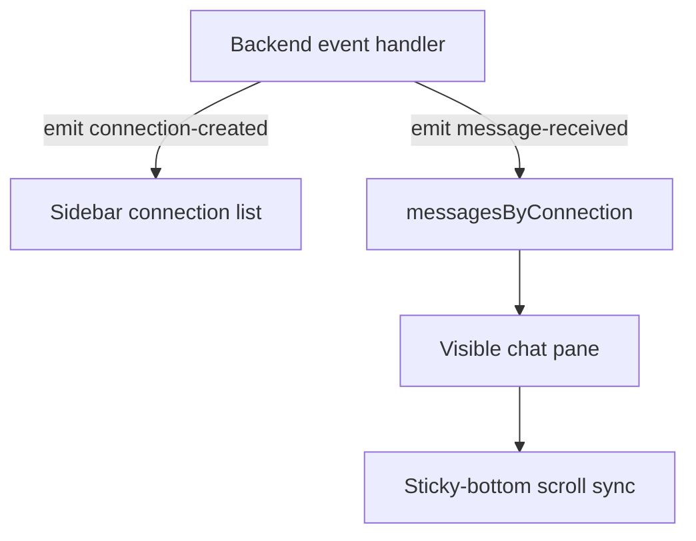
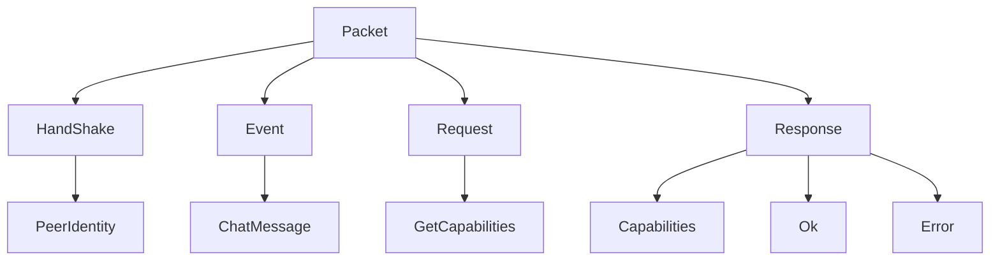
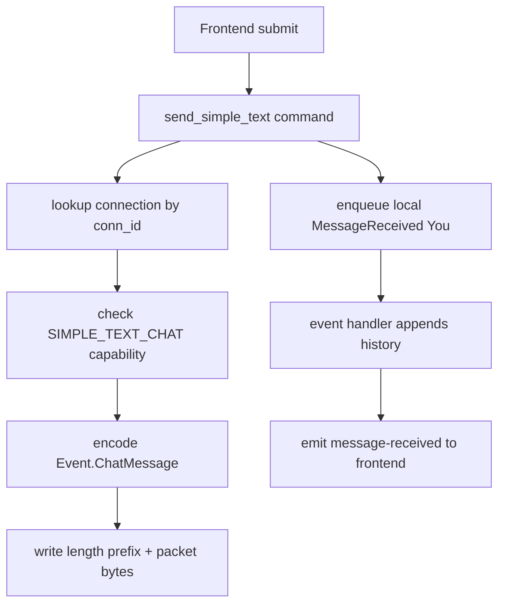
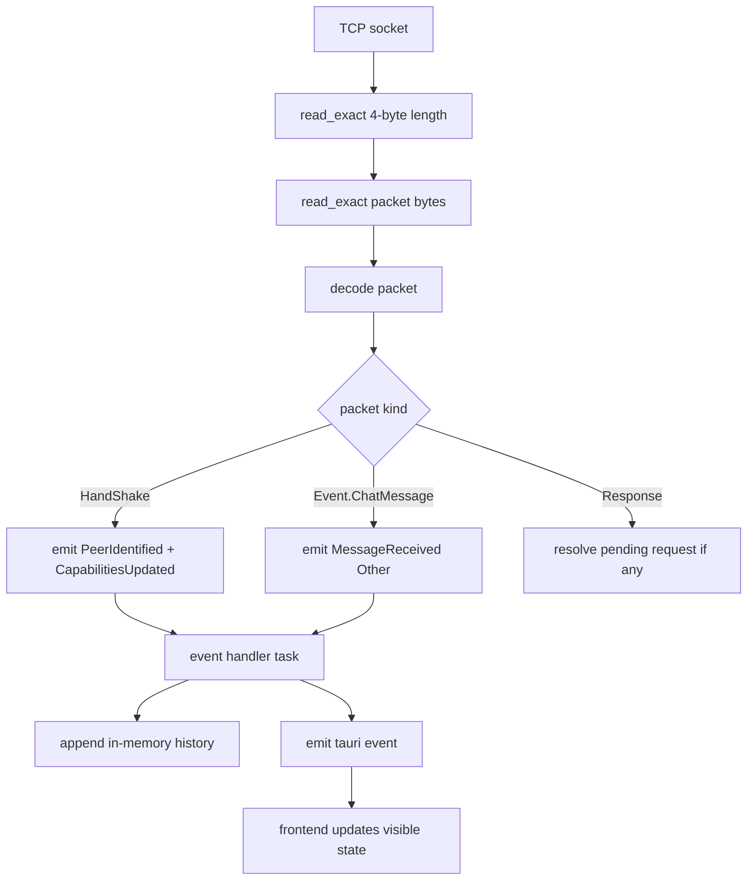

# Ghostline Project Overview

## Overview

Ghostline is a desktop peer-to-peer chat application built with a Tauri shell, a React frontend, and a Rust networking core. The codebase is structured around a clear split:

- The frontend is a thin operator UI for connecting to peers, selecting conversations, and rendering message history.
- The Rust backend owns all networking, protocol encoding and decoding, connection lifecycle management, message persistence in memory, and event fan-out back to the UI.

The project is currently in an active infrastructure phase. The protocol layer, connection abstraction, and frontend event wiring are in place, but some parts of the system are still intentionally incomplete, especially the request-response path and some identity-to-UI alignment details.

## Core Intent

The intended runtime model is:

1. Start a local TCP server when the app launches.
2. Generate a local peer identity once for the running app instance.
3. Allow the user to connect to a remote peer by `host:port`.
4. Exchange a handshake packet as the first application-level packet.
5. Register the connection under the remote peer's `peer_id` after the handshake succeeds.
6. Send chat messages as event packets.
7. Push new connection and message events from Rust into the frontend immediately.
8. Keep message history in backend memory and let the frontend re-fetch or live-append as needed.

## Stack

### Frontend

- React 19
- TypeScript 5
- Vite 7
- Tailwind CSS 4 via `@tailwindcss/vite`
- Tauri JS API

### Backend

- Rust 2021
- Tauri 2
- Tokio full runtime
- `uuid` for peer IDs and fallback username generation
- `whoami` for platform-independent local username detection

## Repository Layout

```text
ghostline/
├── src/
│   ├── App.tsx                     # Frontend state and Tauri integration
│   ├── App.css                     # Global theme and custom scrollbar styling
│   ├── main.tsx                    # React bootstrap
│   ├── components/
│   │   ├── ChatComposer.tsx        # Message input/footer
│   │   ├── ChatHeader.tsx          # Active chat title/status
│   │   ├── MessageList.tsx         # Scrollable message history
│   │   └── Sidebar.tsx             # Server/connect UI + connection list
│   └── types/
│       └── chat.ts                 # Shared frontend payload types
├── src-tauri/
│   ├── Cargo.toml                  # Rust dependencies
│   ├── tauri.conf.json             # Tauri build/runtime config
│   ├── packet_structure.md         # Protocol notes, currently stale in parts
│   └── src/
│       ├── main.rs                 # Tauri binary entry
│       ├── lib.rs                  # App setup, commands, backend event bridge
│       ├── state.rs                # Shared application state
│       ├── peer.rs                 # Local peer identity generation
│       └── net/
│           ├── mod.rs              # Connection runtime and framing loop
│           ├── client.rs           # Outbound TCP connection setup
│           ├── server.rs           # Inbound TCP accept loop
│           ├── utils.rs            # High-level send helpers
│           ├── pending_requests.rs # Early request tracking scaffold
│           ├── bytehandler/
│           │   ├── mod.rs          # ByteReader/ByteWriter + Encode/Decode traits
│           │   └── error.rs        # Protocol decode errors
│           └── packet/
│               ├── mod.rs          # Top-level packet enum and codec
│               ├── handshake.rs    # Peer identity packet
│               ├── event.rs        # Chat event packet
│               ├── request.rs      # Request packet payloads
│               └── responce.rs     # Response packet payloads
├── package.json
├── vite.config.ts
└── PROJECT_OVERVIEW.md
```

## Architecture



## Runtime Flow



## Frontend

## Frontend Responsibilities

The frontend does not own networking logic. It is responsible for:

- collecting a target `host:port` from the user
- calling Tauri commands
- storing UI-only state such as current selection, compose text, and status text
- rendering conversations from backend history
- listening to backend-emitted Tauri events for live updates
- auto-scrolling the active message view while still allowing scrollback

## Frontend File Roles

### [src/App.tsx](/home/immortal/code/ghostline/src/App.tsx)

This is the frontend orchestration layer. It owns:

- server address loading through `get_server_address`
- connection list loading through `get_my_connections`
- chat history fetch through `get_connection_messages`
- outbound send through `send_simple_text`
- Tauri event subscriptions
- sticky-bottom scroll behavior for the active chat
- state maps such as `messagesByConnection`

Important local state:

- `serverAddress`
- `connectAddress`
- `connections`
- `selectedConnection`
- `outboundMessage`
- `messagesByConnection`
- `status`

### [src/components/Sidebar.tsx](/home/immortal/code/ghostline/src/components/Sidebar.tsx)

Contains:

- local server display
- connect form
- connection list
- active connection indicator

### [src/components/ChatHeader.tsx](/home/immortal/code/ghostline/src/components/ChatHeader.tsx)

Displays:

- current selected connection label
- lightweight status text from the frontend app state

### [src/components/MessageList.tsx](/home/immortal/code/ghostline/src/components/MessageList.tsx)

Handles:

- rendering the active conversation only
- per-message visual indicator for local vs remote sender
- the scroll container used by the sticky-bottom logic

### [src/components/ChatComposer.tsx](/home/immortal/code/ghostline/src/components/ChatComposer.tsx)

Handles:

- outbound message input
- send button
- disabled state when no chat is selected or input is empty

### [src/App.css](/home/immortal/code/ghostline/src/App.css)

Defines:

- Tailwind import
- Catppuccin Mocha-like global palette
- radial background treatment
- cross-platform custom scrollbar styling
- page overflow constraints so the app shell remains fixed while only the intended panels scroll

## Frontend Event Model

The UI listens to two backend-emitted Tauri events:

- `ghostline://connection-created`
- `ghostline://message-received`

Those are used to update the UI without waiting for polling.



## Backend

## Tauri Setup

### [src-tauri/src/main.rs](/home/immortal/code/ghostline/src-tauri/src/main.rs)

Minimal entrypoint that delegates to the library crate.

### [src-tauri/src/lib.rs](/home/immortal/code/ghostline/src-tauri/src/lib.rs)

This is the backend application root. It is responsible for:

- constructing and managing `AppState`
- creating the server on `0.0.0.0:8000`
- spawning the accept loop
- exposing Tauri commands
- bridging internal connection events into frontend events
- registering connections only after handshake identity is known

## AppState

### [src-tauri/src/state.rs](/home/immortal/code/ghostline/src-tauri/src/state.rs)

`AppState` contains:

- `server: RwLock<Option<Arc<Server>>>`
- `local_peer: Arc<PeerIdentity>`
- `connections: Arc<Mutex<HashMap<String, Arc<Connection>>>>`

Important point:

- The `connections` map key is the remote peer's `peer_id`, not the socket address, once handshake succeeds.

That is a meaningful architectural choice because it decouples user-visible identity from transient TCP endpoint values.

## Local Peer Identity

### [src-tauri/src/peer.rs](/home/immortal/code/ghostline/src-tauri/src/peer.rs)

The local peer identity is created once at startup.

Fields currently populated:

- `peer_id`: random UUID v4
- `display_name`: `whoami::username()` when available, otherwise `ghost_user_<random>`
- `client_version`: current crate version from `CARGO_PKG_VERSION`
- `capabilities`: static capability list
- `timestamp`: current UNIX timestamp in seconds

This identity becomes the first handshake packet sent on every new connection.

## Tauri Commands

### `get_server_address`

Returns the server bind address if the server has been started.

### `connect_to_host(addr)`

Creates a `Client`, opens a TCP connection, builds a `Connection`, and spawns an event handler task for that connection.

Important detail:

- The `Connection` is not immediately inserted into the shared connection map inside this function.
- It is registered only after the remote peer is identified via handshake.

### `get_connection_messages(id, limit, skip)`

Looks up a connection by ID and returns in-memory message history as `Vec<(String, String)>`.

### `get_my_connections`

Returns all current connection IDs from shared state.

### `send_simple_text(conn_id, msg)`

Looks up the connection, sends the event packet, then enqueues a local `MessageReceived` event with sender `"You"` so the same event pipeline is used for both local and remote message history updates.

## Networking Layer

## Connection Abstraction

### [src-tauri/src/net/mod.rs](/home/immortal/code/ghostline/src-tauri/src/net/mod.rs)

`Connection` is the core runtime object.

It owns:

- socket write half wrapped in `Arc<Mutex<_>>`
- pending request map
- monotonic request ID counter
- remote capability list
- in-memory message history
- an `mpsc::Sender<ConnectionEvent>` for async event fan-out

### Why the channel exists

The read loop must not block on slow downstream work such as:

- updating UI state
- storing message history
- future database or disk writes
- future network-side fan-out

So the design is:

```text
socket read loop -> mpsc channel -> separate handler task -> history update + frontend emit
```

That keeps the read loop focused on framing, decoding, and event production.

## Connection Events

`ConnectionEvent` currently has three variants:

- `PeerIdentified { peer }`
- `MessageReceived { from, message }`
- `CapabilitiesUpdated { caps }`

These events are consumed in `spawn_connection_event_handler` in `lib.rs`.

## Transport Framing

The current TCP transport framing is:

```text
[length: u32 big-endian][encoded packet bytes]
```

This framing lives in `src-tauri/src/net/mod.rs`, not inside the packet codec itself.

### Send path

1. Encode packet into a `Vec<u8>`.
2. Compute packet byte length.
3. Write 4-byte big-endian length prefix.
4. Write packet bytes.

### Receive path

1. `read_exact` 4 bytes for the length prefix.
2. Parse `u32` packet length.
3. Reject oversized packets above `MAX_PACKET_LEN`.
4. Allocate a buffer of exactly that size.
5. `read_exact` the packet bytes.
6. Pass the packet bytes to `decode(&buf)`.

This is materially safer and more deterministic than assuming one `read()` call returns exactly one application packet.

## Server and Client

### [src-tauri/src/net/client.rs](/home/immortal/code/ghostline/src-tauri/src/net/client.rs)

`Client`:

- stores the destination address
- stores the local peer identity
- opens a `TcpStream`
- splits it into read and write halves
- returns `(Connection, Receiver<ConnectionEvent>)`

### [src-tauri/src/net/server.rs](/home/immortal/code/ghostline/src-tauri/src/net/server.rs)

`Server`:

- binds a listener
- accepts incoming sockets forever
- constructs `Connection` for each accepted socket
- passes the connection, event receiver, and socket address to the caller callback

## Packet System

## Packet Families



## Top-Level Packet Encoding

### [src-tauri/src/net/packet/mod.rs](/home/immortal/code/ghostline/src-tauri/src/net/packet/mod.rs)

The packet codec currently defines four top-level packet types:

- `Event`
- `Request`
- `Response`
- `HandShake`

Top-level wire structure inside the encoded packet bytes is currently:

```text
[version: u8][packet_type: u8][payload...]
```

The outer transport framing adds the length prefix separately at the socket layer.

### Packet version

- Current version is fixed to `1`
- Decode rejects any other version with `PacketError::InvalidVersion`

## Handshake Packet

### [src-tauri/src/net/packet/handshake.rs](/home/immortal/code/ghostline/src-tauri/src/net/packet/handshake.rs)

The handshake payload currently contains:

- `peer_id`
- `display_name`
- `client_version`
- `capabilities`
- `timestamp`

This packet acts as the first identity exchange between peers.

## Event Packet

### [src-tauri/src/net/packet/event.rs](/home/immortal/code/ghostline/src-tauri/src/net/packet/event.rs)

Currently implemented event subtype:

- `ChatMessage(String)`

## Request Packet

### [src-tauri/src/net/packet/request.rs](/home/immortal/code/ghostline/src-tauri/src/net/packet/request.rs)

Currently implemented request subtype:

- `GetCapabilities`

This exists structurally, but the runtime path using it is not yet complete.

## Response Packet

### [src-tauri/src/net/packet/responce.rs](/home/immortal/code/ghostline/src-tauri/src/net/packet/responce.rs)

Currently implemented response variants:

- `Capabilities { caps }`
- `Ok`
- `Error { message }`

## Byte Codec Layer

### [src-tauri/src/net/bytehandler/mod.rs](/home/immortal/code/ghostline/src-tauri/src/net/bytehandler/mod.rs)

The bytehandler module provides:

- `ByteWriter`
- `ByteReader`
- `Encode` trait
- `Decode` trait

Supported primitive operations:

- `u8`
- `u32`
- `u64`
- UTF-8 strings with `u32` length prefix
- raw byte slices for writing

### [src-tauri/src/net/bytehandler/error.rs](/home/immortal/code/ghostline/src-tauri/src/net/bytehandler/error.rs)

Decode errors are explicit and structured:

- unexpected EOF
- invalid UTF-8
- unknown packet subtype
- invalid protocol version

This is a good base for hardening the protocol layer later.

## Messaging Behavior

## Sending a message



## Receiving a message



## Current UI and Identity Model

The frontend connection list is driven by IDs returned from `get_my_connections`, which are remote `peer_id` values after registration.

There is one current-state caveat in [src/App.tsx](/home/immortal/code/ghostline/src/App.tsx):

- right after `connect_to_host(addr)`, the UI still temporarily sets `selectedConnection` to the raw `addr`
- backend registration later switches the real canonical key to the remote `peer_id`
- the emitted `connection-created` event appends the canonical ID to the sidebar

This means the project is already moving to peer-ID-based identity, but the frontend selection flow is not fully normalized yet.

## Build and Runtime Configuration

### Frontend build

Defined in [package.json](/home/immortal/code/ghostline/package.json):

- `bun run dev`
- `bun run build`
- `bun run preview`
- `bun run tauri`

### Vite config

### [vite.config.ts](/home/immortal/code/ghostline/vite.config.ts)

Important settings:

- Tailwind plugin enabled
- fixed port `1420`
- Tauri dev HMR support on port `1421`
- `src-tauri` ignored for frontend file watching

### Tauri config

### [src-tauri/tauri.conf.json](/home/immortal/code/ghostline/src-tauri/tauri.conf.json)

Important settings:

- desktop window title `ghostline`
- base size `800x600`
- `beforeDevCommand`: `bun run dev`
- `beforeBuildCommand`: `bun run build`
- frontend dist directory `../dist`

## Current Strengths

The project already has several solid architectural decisions:

- clear separation between transport framing and packet encoding
- trait-based byte codec instead of ad hoc byte parsing scattered across the codebase
- handshake-first identity exchange
- connection registration delayed until peer identity is known
- channel-based event fan-out so the socket read loop stays focused and responsive
- backend-driven live frontend updates through Tauri events
- frontend split into reusable components instead of a single monolithic file

## Current Gaps and Risks

These are the most important incomplete or risky areas in the current codebase.

### 1. Request handling is incomplete

In [src-tauri/src/net/mod.rs](/home/immortal/code/ghostline/src-tauri/src/net/mod.rs), inbound request handling still ends at `todo!()`. Any peer sending a request packet on that path will hit unfinished logic.

### 2. Response handling returns from the read loop early

In the same file, when a pending response is matched, the current code does `return` from the spawned task. That likely terminates the entire read loop after resolving a single pending request. That is a behavioral bug if request-response traffic becomes active.

### 3. Capability negotiation is only partially formalized

The code currently uses handshake identity to carry capabilities and updates local connection capabilities from that. The older response-based capability path is still present in comments and packet types, which suggests the design is in transition.

### 4. Message history is in-memory only

Conversation history is stored on `Connection` objects in memory. There is no persistence across app restarts.

### 5. Connection cleanup is not robust yet

There is no clear removal path from `AppState.connections` when a peer disconnects or a connection task exits.

### 7. Frontend connection selection still needs peer-ID normalization

The frontend should stop assuming the outbound connection key is the raw address once handshake registration completes.

## Next Steps To Be Taken

If this project is being advanced toward a stable chat client, the highest-value next steps are:

1. Finish the inbound request handling path and remove the `todo!()`.
2. Fix the response branch so handling one response does not terminate the read loop.
3. Normalize frontend selection and connection display around `PeerIdentity`, not raw string IDs.
4. Introduce explicit disconnect and connection cleanup events.
6. Consider storing a richer connection record in app state instead of only `Arc<Connection>`, so display name, peer metadata, and connection state can be rendered directly.
7. Add integration tests for packet round-trips and length-prefixed framing behavior.

## Summary

Ghostline is already more than a scaffold. It has a real protocol layer, real connection lifecycle handling, a handshake-based identity model, and a frontend that reacts to backend events in near real time. The codebase is not finished, but its direction is clear: a peer-aware desktop chat application with a custom binary protocol and a Rust-first networking core.

The main work left is not foundational architecture. The main work left is tightening the edges: completing request handling, cleaning up state transitions, aligning the UI with peer identity semantics, and hardening the protocol/runtime behavior.
