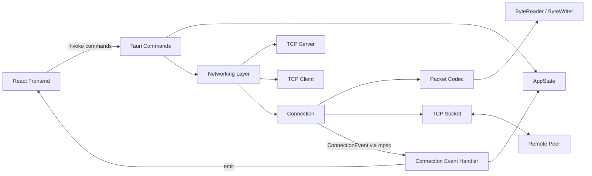
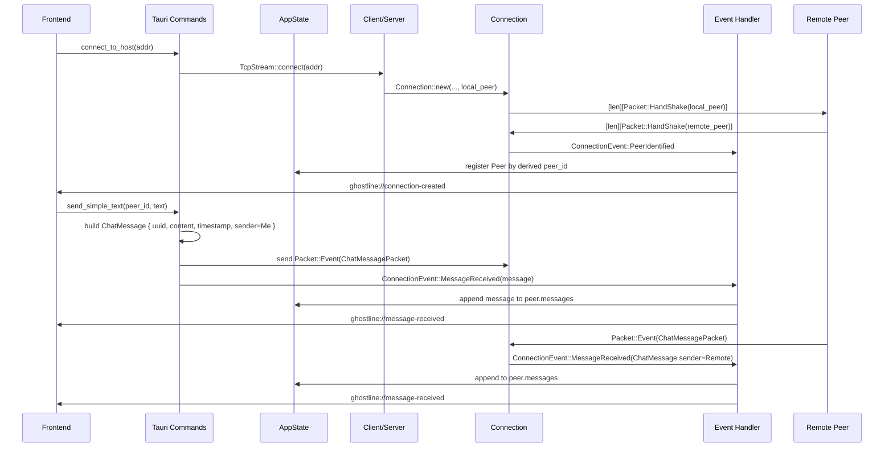
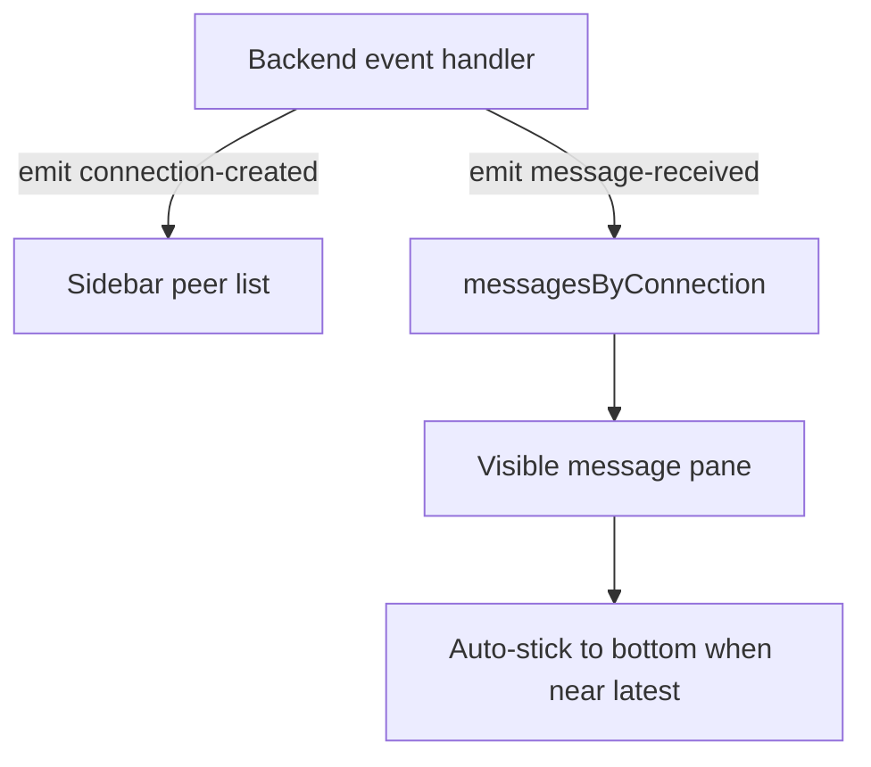
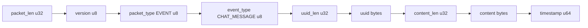

# Ghostline Project Overview

## Overview

Ghostline is a Tauri desktop chat application with a React frontend and a Rust backend. The codebase is centered around a Rust-first networking model:

- the frontend is a thin interface for connection management and message rendering
- the backend owns transport framing, packet encode/decode, peer identity, runtime state, and event fan-out

The current design direction is a peer-to-peer or direct-peer chat tool where identity comes from exchanged public keys instead of transient socket addresses.

## High-Level Intent

The current runtime model is:

1. Generate or load a local Ed25519 identity.
2. Start a local TCP server on app launch.
3. Connect to another peer by `host:port`.
4. Exchange a handshake packet carrying peer identity and capabilities.
5. Derive a stable peer ID from the remote peer's public key.
6. Register that peer in backend state.
7. Send chat messages as structured event packets.
8. Push live updates to the frontend through Tauri events.
9. Keep the frontend synchronized with backend-owned peer/message state.

## Technology Stack

### Frontend

- React 19
- TypeScript 5
- Vite 7
- Tailwind CSS 4
- Tauri JS API

### Backend

- Rust 2021
- Tauri 2
- Tokio async runtime
- `uuid`
- `whoami`
- `ed25519-dalek`
- `rand`
- `bs58`
- `dirs`

## Repository Structure

```text
ghostline/
├── src/
│   ├── App.tsx
│   ├── App.css
│   ├── main.tsx
│   ├── components/
│   │   ├── Sidebar.tsx
│   │   ├── ChatHeader.tsx
│   │   ├── MessageList.tsx
│   │   └── ChatComposer.tsx
│   └── types/
│       └── chat.ts
├── src-tauri/
│   ├── Cargo.toml
│   ├── tauri.conf.json
│   └── src/
│       ├── main.rs
│       ├── lib.rs
│       ├── state.rs
│       ├── peer.rs
│       ├── models/
│       │   ├── mod.rs
│       │   └── chat_message.rs
│       ├── crypto/
│       │   ├── mod.rs
│       │   ├── error.rs
│       │   └── local_identity.rs
│       └── net/
│           ├── mod.rs
│           ├── client.rs
│           ├── server.rs
│           ├── utils.rs
│           ├── pending_requests.rs
│           ├── bytehandler/
│           │   ├── mod.rs
│           │   └── error.rs
│           └── packet/
│               ├── mod.rs
│               ├── handshake.rs
│               ├── request.rs
│               ├── responce.rs
│               └── event/
│                   ├── mod.rs
│                   └── chat_message.rs
├── package.json
├── vite.config.ts
├── README.md
└── PROJECT_OVERVIEW.md
```

## Architecture



## Runtime Flow



## Frontend

## Frontend Responsibilities

The frontend is responsible for:

- connecting to a peer by `host:port`
- listing known peer IDs
- selecting the active chat
- fetching chat history from the backend
- listening to backend-emitted connection and message events
- rendering structured messages with sender and timestamp
- handling sticky-bottom message scrolling

## Frontend File Roles

### [src/App.tsx](/home/immortal/code/ghostline/src/App.tsx)

This file owns frontend orchestration:

- command calls through `invoke(...)`
- local UI state
- Tauri event listeners
- chat refresh logic
- sticky-bottom scroll behavior

Important state:

- `serverAddress`
- `connectAddress`
- `connections`
- `selectedConnection`
- `messagesByConnection`
- `outboundMessage`
- `status`

### [src/components/Sidebar.tsx](/home/immortal/code/ghostline/src/components/Sidebar.tsx)

Handles:

- server display
- connect form
- peer list
- active peer selection

### [src/components/ChatHeader.tsx](/home/immortal/code/ghostline/src/components/ChatHeader.tsx)

Handles:

- active peer label
- status text

### [src/components/MessageList.tsx](/home/immortal/code/ghostline/src/components/MessageList.tsx)

Handles:

- rendering structured message objects
- 12-hour timestamp formatting
- local vs remote styling
- the scroll container for the message pane

### [src/components/ChatComposer.tsx](/home/immortal/code/ghostline/src/components/ChatComposer.tsx)

Handles:

- outbound input field
- send action
- disabled state when send is not valid

### [src/types/chat.ts](/home/immortal/code/ghostline/src/types/chat.ts)

Defines the frontend payload types expected from the backend:

- `ChatEntry`
- `MessageSender`
- `MessageEventPayload`
- `ConnectionEventPayload`

## Frontend Event Model

The frontend listens to:

- `ghostline://connection-created`
- `ghostline://message-received`

Current message event shape:

```text
{
  peer_id: string,
  message: {
    uuid: string,
    content: string,
    timestamp: number,
    sender: "Me" | "Remote"
  }
}
```



## Backend

## Tauri Setup

### [src-tauri/src/main.rs](/home/immortal/code/ghostline/src-tauri/src/main.rs)

Minimal binary entrypoint that delegates to the library crate.

### [src-tauri/src/lib.rs](/home/immortal/code/ghostline/src-tauri/src/lib.rs)

This is the backend application root. It is responsible for:

- loading or generating the local identity
- constructing `AppState`
- creating the TCP server on `0.0.0.0:8000`
- spawning the accept loop
- registering Tauri commands
- converting internal connection events into frontend events
- storing messages on `Peer` objects instead of directly on `Connection`

## AppState

### [src-tauri/src/state.rs](/home/immortal/code/ghostline/src-tauri/src/state.rs)

`AppState` currently stores:

- `server: RwLock<Option<Arc<Server>>>`
- `local_peer: Arc<PeerIdentity>`
- `peers: Arc<Mutex<HashMap<String, Arc<Peer>>>>`
- `local_identity: Arc<LocalIdentity>`

The important shift is that backend state is now peer-centric rather than connection-centric.

## Peer Model

### [src-tauri/src/peer.rs](/home/immortal/code/ghostline/src-tauri/src/peer.rs)

`Peer` contains:

- `peer_id`: derived from remote public key bytes
- `identity`: full handshake identity from the remote peer
- `connection`: the active `Connection`
- `messages`: in-memory `Vec<ChatMessage>`
- `status`: `Connected` or `Disconnected`

This separates remote peer identity from the transport object and makes it possible to carry richer metadata in one place.

## Message Model

### [src-tauri/src/models/chat_message.rs](/home/immortal/code/ghostline/src-tauri/src/models/chat_message.rs)

`ChatMessage` is the current application-level message shape:

- `uuid: String`
- `content: String`
- `timestamp: u64`
- `sender: MessageSender`

`MessageSender` values:

- `Me`
- `Remote`

This same model is used for:

- backend peer history
- backend-to-frontend events
- frontend rendering

## Crypto Layer

### [src-tauri/src/crypto/local_identity.rs](/home/immortal/code/ghostline/src-tauri/src/crypto/local_identity.rs)

`LocalIdentity` manages the local Ed25519 keypair.

Capabilities currently implemented:

- generate a new identity
- load a stored identity from disk
- save a generated identity to disk
- expose verifying key bytes
- derive a stable peer ID from the public key
- sign arbitrary bytes

The default identity path is under:

```text
~/.ghostline/identity.key
```

### [src-tauri/src/crypto/mod.rs](/home/immortal/code/ghostline/src-tauri/src/crypto/mod.rs)

This module provides:

- `derive_peer_id(verifying_key)`
- `peer_id_from_bytes(public_key_bytes)`
- `verify_signature(public_key_bytes, message, signature_bytes)`
- `default_identity_path()`

## Networking Layer

## Connection Model

### [src-tauri/src/net/mod.rs](/home/immortal/code/ghostline/src-tauri/src/net/mod.rs)

`Connection` owns:

- socket writer
- pending request map
- request ID counter
- connection capabilities
- async event sender

It no longer acts as the direct long-term holder of chat history. That responsibility moved into `Peer`.

## Connection Events

`ConnectionEvent` currently has three variants:

- `PeerIdentified { peer }`
- `MessageReceived(ChatMessage)`
- `CapabilitiesUpdated { caps }`

The read loop sends these into a Tokio `mpsc` channel. A separate handler task receives them and performs slower follow-up work such as peer registration, history updates, and frontend event emission.

## Client and Server

### [src-tauri/src/net/client.rs](/home/immortal/code/ghostline/src-tauri/src/net/client.rs)

`Client`:

- stores destination address
- stores local peer identity
- opens `TcpStream`
- splits the stream
- builds a `Connection`
- returns the connection plus event receiver

### [src-tauri/src/net/server.rs](/home/immortal/code/ghostline/src-tauri/src/net/server.rs)

`Server`:

- binds a `TcpListener`
- accepts sockets forever
- creates `Connection`
- forwards the connection, event receiver, and socket address to the caller

## Packet System

## Top-Level Packet Kinds

### [src-tauri/src/net/packet/mod.rs](/home/immortal/code/ghostline/src-tauri/src/net/packet/mod.rs)

Top-level packet enum:

- `Event`
- `Request`
- `Response`
- `HandShake`

Top-level encoded packet structure:

```text
[version: u8][packet_type: u8][payload...]
```

Transport framing is separate and adds a 4-byte packet length prefix before the encoded packet bytes.

## Transport Framing

At the socket level, Ghostline currently uses:

```text
[u32 packet_len][packet bytes]
```

Receive flow:

1. read 4 bytes for length
2. parse `packet_len`
3. allocate buffer
4. `read_exact` packet bytes
5. decode packet

This is the correct approach for TCP because application packet boundaries are not preserved by the transport.

## Handshake Packet

### [src-tauri/src/net/packet/handshake.rs](/home/immortal/code/ghostline/src-tauri/src/net/packet/handshake.rs)

`PeerIdentity` currently contains:

- `public_key_bytes: [u8; 32]`
- `display_name: String`
- `client_version: String`
- `capabilities: Vec<String>`
- `timestamp: u64`

This is the first application-level packet sent on a new connection.

Handshake payload encoding:

```text
[subtype: u8]
[public_key_len: u32][public_key_bytes]
[display_name_len: u32][display_name_utf8]
[client_version_len: u32][client_version_utf8]
[cap_count: u32]
  repeated cap_count times:
  [cap_len: u32][cap_utf8]
[timestamp: u64]
```

## Event Packet

### [src-tauri/src/net/packet/event/mod.rs](/home/immortal/code/ghostline/src-tauri/src/net/packet/event/mod.rs)

Currently implemented event subtype:

- `ChatMessage(ChatMessagePacket)`

### [src-tauri/src/net/packet/event/chat_message.rs](/home/immortal/code/ghostline/src-tauri/src/net/packet/event/chat_message.rs)

`ChatMessagePacket` contains:

- `uuid`
- `content`
- `timestamp`

The sender is intentionally not sent on wire. Sender is assigned locally based on direction:

- sent locally -> `Me`
- received from remote -> `Remote`

## Chat Message Packet Structure

This is the current chat event payload path as implemented.

### Transport frame

```text
[u32 packet_len][packet bytes]
```

### Packet bytes

```text
[version: u8]
[packet_type: u8 = 1]
[event_type: u8 = 1]
[uuid_len: u32][uuid_utf8]
[content_len: u32][content_utf8]
[timestamp: u64]
```

### Layout diagram



### Example shape

```text
| 4B packet_len |
| 1B version |
| 1B packet_type |
| 1B event_type |
| 4B uuid_len | uuid bytes |
| 4B content_len | content bytes |
| 8B timestamp |
```

## Bytehandler Layer

### [src-tauri/src/net/bytehandler/mod.rs](/home/immortal/code/ghostline/src-tauri/src/net/bytehandler/mod.rs)

The bytehandler provides:

- `ByteWriter`
- `ByteReader`
- `Encode`
- `Decode`

Supported helpers include:

- `write_u8`
- `write_u32`
- `write_u64`
- `write_u8_array`
- `write_string`
- `read_u8`
- `read_u32`
- `read_u64`
- `read_u8_array`
- `read_string`

The `u8_array` helpers use:

```text
[u32 len][len bytes]
```

## Current Backend Command Surface

Implemented Tauri commands:

- `get_server_address`
- `connect_to_host`
- `get_connection_messages`
- `get_my_connections`
- `send_simple_text`
- `greet`

## Build and Runtime Configuration

### Frontend commands

```bash
bun run dev
bun run build
```

### Rust build

```bash
cargo build --manifest-path src-tauri/Cargo.toml
```

### Tauri runtime config

Important current config:

- frontend dev URL: `http://localhost:1420`
- Vite strict port: `1420`
- Tauri window size: `800x600`
- frontend build output: `dist/`

## Current Strengths

The project already has a strong foundation in a few important areas:

- transport framing is explicit and correct for TCP
- packet encode/decode is centralized and typed
- peer identity is moving to public-key-backed semantics
- local identity is persistent across runs
- backend state is peer-centric instead of only connection-centric
- message history uses a structured application model
- frontend is already wired to backend live events
- UI and backend responsibilities are clearly separated

## Current Gaps and Risks

The current code still has several unfinished edges:

1. request handling still only replies with a generic `not implemented` error
2. peer disconnect lifecycle is not fully handled yet
3. peer list UI still renders peer IDs rather than richer identity metadata such as `display_name`
4. some crypto helpers and peer fields are present but not fully exercised yet
5. message history is in-memory only
6. there are still warnings around unused request/response scaffolding and crypto helpers

## Summary

Ghostline is no longer just a Tauri template with a toy chat screen. It now has:

- a real socket transport
- structured packet encoding and decoding
- handshake-driven peer registration
- a persistent local identity
- peer IDs derived from public keys
- a structured chat message model flowing from backend to frontend
- a frontend that reacts to live backend events instead of owning message truth itself

The next meaningful layer is not basic infrastructure anymore. The next layer is hardening and enrichment: authenticated handshakes, disconnect handling, richer peer display metadata, persistence, and full request/response support.
